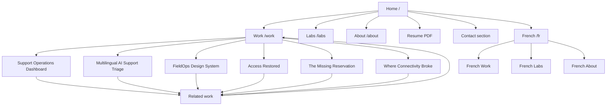

# Portfolio v2 — Information Architecture and Content Design

**Status:** Proposed architecture for Breno's review

**Date:** 2026-09-21

**Scope:** Page hierarchy, navigation, content structure, recruiter journey, project taxonomy, localization, ATS/SEO alignment, accessibility requirements, migration rules, and release gates.

**Out of scope:** Wireframes, visual redesign, component implementation, final case-study copy, and production deployment.

## 1. Purpose

Portfolio v2 will reposition Breno from a support-first candidate with UX/UI as a secondary skill into a credible product-design and frontend candidate progressing toward Design Engineering.

The site must communicate three truths without inflating experience:

1. Breno already has strong operational judgment, multilingual communication, UX/UI training, and experience translating complex workflows.
2. Breno is actively building frontend capability and can demonstrate it through public code and working interfaces.
3. The title `Design Engineer` becomes the primary public identity only after the portfolio contains enough shipped evidence to support it.

The recommended transitional positioning is:

> **Product designer building accessible interfaces in React — grounded in 8+ years of multilingual operations.**

The site is not a course diary and not a gallery of polished screens. It is an evidence system for recruiters, hiring managers, designers, and engineers evaluating Breno for junior Design Engineer, UX Engineer, product design, UI engineering, and design-system-adjacent roles in Europe and Canada.

## 2. Success Criteria

A successful v2 enables a recruiter to:

- understand Breno's target and differentiator within 10 seconds;
- identify two or three relevant built projects within 30 seconds;
- open a live product, GitHub repository, or implementation evidence within 60 seconds;
- distinguish shipped work, prototypes, simulations, learning exercises, and planned work;
- understand Breno's exact role and decisions in each case;
- verify UX, UI, frontend, accessibility, AI, and business reasoning without reading an 11,000-pixel report first;
- find the correct resume, LinkedIn, GitHub, location, languages, and work-authorization facts without ambiguity;
- read the primary experience comfortably on desktop and mobile, in English or French.

The architecture is ready to replace the current public positioning only when at least one flagship project passes the release gate in section 18.

## 3. Audiences and Their Primary Questions

| Audience | Primary question | Evidence they need |
|---|---|---|
| Recruiter | Is Breno relevant to this role and location? | Clear headline, target roles, location, languages, work authorization, concise project summaries, resume |
| Design hiring manager | Can he frame problems and make sound product decisions? | Constraints, research, alternatives, trade-offs, testing, iterations, outcomes |
| Engineering hiring manager | Can he build and maintain what he designs? | Live demo, repository, React/TypeScript, components, API/data states, tests, accessibility, performance |
| Product leader | Does he connect user needs to operational and business impact? | Success measures, risk, adoption, error reduction, workflow improvement, limitations |
| ATS/application system | Does the application contain the role's required terminology and factual experience? | Role-specific resume with exact supported skills; the portfolio supports rather than replaces the resume |

## 4. Architecture Principles

1. **Proof before aspiration.** Future learning belongs in Labs or a concise learning status, not in the main project hierarchy.
2. **Built work leads.** Flagships require a working implementation, not only Figma screens or a written concept.
3. **Two reading depths.** Every case starts with a fast executive summary and offers deeper evidence afterward.
4. **One claim, one proof.** React links to code; accessibility links to checks; research links to notes; business impact links to real measurements or a clearly labelled hypothesis.
5. **Operational experience is the differentiator, not the destination.** It explains why Breno is strong at workflows, handoffs, edge cases, service recovery, and multilingual products.
6. **AI is a method, not an identity.** The site documents where AI helped, where it failed, and what Breno personally verified.
7. **The existing visual and motion language is retained.** The v2 changes hierarchy, content, and evidence without redesigning typography, transitions, scroll behavior, reveal choreography, or the progress-navigation system.
8. **No orphan pages.** Every public page is reachable from a hub, a related-work module, or the footer.

### 4.1 Protected visual and motion system

The following behaviors are non-negotiable continuity requirements for v2:

- the desktop `ScrollProgress` rail pinned to the left gutter;
- the vertical line, section dots, active dot, pulse, hover preview, and active section label;
- automatic tracking of the section currently crossing the viewport threshold;
- the compact mobile/touch dock with active section name and dots;
- tap and horizontal-swipe navigation between case sections;
- the dock's light/dark adaptation over contrasting content;
- smooth scrolling and route-aware entrance behavior;
- the current glass header, its transitions, and its dark/light adaptation;
- `Reveal`, masked title reveals, `Scramble`, `ProcessReveal`, and their timing language;
- scroll-led project-card scenes, image transitions, hover responses, and progress fills;
- case-section entrances, collapsible behavior, image expansion, and back-to-top behavior;
- reduced-motion alternatives that preserve content and navigation.

The architecture may supply new section names and different content, but it must keep the implementation contract used by the existing progress system: every tracked area remains a `main section[id]` with a stable `data-label` or `aria-label`. New Home, Work, Labs, About, and flagship case sections plug into this contract instead of replacing it.

Accessibility improvements must be additive and visually faithful. For example, the mobile dots may receive larger invisible hit areas, improved focus treatment, and stronger accessible names while preserving their size, movement, active-state animation, swipe behavior, and overall appearance.

Any future proposal to remove, replace, restyle, or materially retime these effects requires a separate visual review and explicit approval. It is not included in the portfolio v2 information-architecture implementation.

## 5. Recommended Page Hierarchy

```text
Homepage (/)
├── Work (/work)
│   ├── Support Operations Dashboard (/work/service-operations)
│   ├── Multilingual AI Support Triage (/work/triageai)
│   ├── FieldOps Design System (/work/design-system)
│   ├── Access Restored (/work/access-restored)
│   ├── The Missing Reservation (/work/missing-reservation)
│   └── Where Connectivity Broke (/work/connectivity-broke)
├── Labs (/labs)
│   └── Individual experiments use anchors or filtered cards, not separate routes
├── About (/about)
├── Resume — English (/breno-sampaio-resume-en.pdf)
└── Resume — French (/breno-sampaio-resume-fr.pdf)

French equivalents
├── French home (/fr)
├── French work index (/fr/work)
├── French flagship cases (/fr/work/{slug})
├── French labs summary (/fr/labs)
└── French about (/fr/about)
```

English remains on the existing unprefixed URLs to preserve current links. French receives shareable, indexable `/fr` URLs instead of existing only as client-side state. `hreflang` links connect the English and French equivalents.

Not every small Lab requires a full French translation. The `/fr/labs` page may summarize experiments and link to English technical detail when a translation does not exist, provided the language change is explicit before navigation.

## 6. Visual Sitemap



## 7. URL Map and Priority

| Page | URL | Parent | Navigation | Priority | Indexing |
|---|---|---|---|---|---|
| Homepage | `/` | — | Logo/header | Critical | Index |
| Work index | `/work` | Home | Header | Critical | Index |
| Service Operations | `/work/service-operations` | Work | Featured | Critical after release gate | Index |
| AI Support Triage | `/work/triageai` | Work | Featured | Critical after release gate | Index |
| Design System | `/work/design-system` | Work | Featured | High after release gate | Index |
| Access Restored | `/work/access-restored` | Work | Operational archive | Low | Index, but not featured |
| Missing Reservation | `/work/missing-reservation` | Work | Operational archive | Medium | Index, but not featured |
| Connectivity Broke | `/work/connectivity-broke` | Work | Operational archive | Low | Index, but not featured |
| Labs | `/labs` | Home | Header | High | Index |
| About | `/about` | Home | Header | High | Index |
| English resume | `/breno-sampaio-resume-en.pdf` | Global | Header/footer | Critical | Direct file |
| French resume | `/breno-sampaio-resume-fr.pdf` | Global | Language-aware | Critical | Direct file |
| French pages | `/fr/...` | English equivalent | Language selector | High | Index with hreflang |
| Not found | automatic 404 | — | Error recovery | Supporting | No index |

The existing `/work/service-operations` and `/work/triageai` temporary redirects are replaced by real pages only after the corresponding projects satisfy their release gates. Until then, the redirects remain.

## 8. Global Navigation

### Desktop header

Ordered items:

1. Work
2. Labs
3. About
4. Contact
5. GitHub
6. Resume — primary button
7. Language
8. Theme

The logo always returns to the homepage. Resume remains the strongest utility action, but `View built work` is the main conversion action inside the hero.

### Mobile header

Always visible:

- logo;
- Work;
- About;
- More button.

The More panel contains:

- Labs;
- Contact;
- GitHub;
- Resume;
- language;
- theme.

The panel must trap no focus, close with Escape, close after navigation, and expose its expanded state to assistive technology.

### Footer

The footer contains:

- short positioning line;
- Valencia, Spain;
- target work arrangements stated factually;
- email;
- LinkedIn;
- GitHub;
- English/French resume;
- links to Work, Labs, and About.

Contact remains a homepage section and footer function. A separate `/contact` page is unnecessary.

## 9. Homepage Specification

The homepage is a recruiter summary, not the entire portfolio.

### 9.1 Hero

Required content:

- location and availability;
- transitional professional identity;
- one-sentence value proposition;
- target-role line;
- `View built work` primary action;
- GitHub secondary action;
- Resume utility action;
- portrait.

Recommended message hierarchy:

> **I design and build accessible product interfaces for complex, real-world workflows.**

> Product designer building in React and TypeScript, grounded in 8+ years of multilingual operations across Spain and France.

The hero must not claim seniority, production scale, full-stack expertise, or the Design Engineer title before the work supports those claims.

### 9.2 Featured work

Show a maximum of three cards:

1. Support Operations Dashboard;
2. Multilingual AI Support Triage;
3. FieldOps Design System.

Each card displays:

- project category;
- title;
- one-sentence problem;
- Breno's contribution;
- current status: `Built`, `Prototype`, or `In progress`;
- core stack;
- evidence actions such as Live, Case study, and GitHub.

If a flagship has not passed its release gate, it may appear only as `In progress` in Labs. It must not occupy a featured case slot.

### 9.3 Capabilities

Replace the support capability map with three truthful groups:

- **Product and operations:** workflow mapping, requirements, edge cases, multilingual service context;
- **Design:** interaction design, UI systems, prototyping, accessibility, user testing;
- **Building:** HTML, CSS, JavaScript, React, Next.js, Git, and later TypeScript/API/backend skills when evidenced.

Use `Strong now`, `Building now`, and `Next` labels. Planned skills must never be visually indistinguishable from proven skills.

### 9.4 Experience bridge

Keep the professional timeline, but frame it around transferable evidence:

- handling high-context operational problems;
- cross-team ownership and handoffs;
- multilingual communication;
- onboarding and documentation;
- UX/UI practice and independent product work.

### 9.5 How Breno works

Replace the support-only five-stage process with a product-delivery model:

1. Understand the workflow and business constraint;
2. Define users, states, risks, and success signals;
3. Explore and prototype alternatives;
4. Build, test, and validate;
5. Measure, document, and iterate.

### 9.6 About preview

A concise bridge to `/about`, focused on the move from operations through UX into frontend development.

### 9.7 Contact

Include target roles, location, work arrangement, one canonical email address, LinkedIn, GitHub, and resume. Canada mobility appears as a factual hiring note, not the dominant message.

## 10. Work Index Specification

`/work` is the portfolio hub.

### 10.1 Introduction

Explain that the collection combines product design, frontend implementation, design systems, AI-assisted workflows, and operational problem solving.

### 10.2 Built products

Contains only projects with working interfaces and accessible public evidence. Cards show Live, GitHub, and Case study links.

### 10.3 Design systems and component work

Contains the FieldOps Design System and future component engineering work. Evidence includes tokens, variants, Storybook or equivalent documentation, keyboard behavior, accessibility, and code.

### 10.4 Operational reasoning archive

Contains the three current support simulations. Add an explicit section introduction:

> Earlier independent labs demonstrating structured troubleshooting, evidence handling, escalation boundaries, and technical communication. These are synthetic scenarios, not production client work.

The archive demonstrates transferable reasoning without competing with the new target identity.

### 10.5 Project filters

Do not add complex filtering at launch. Three static sections are easier to scan and maintain. Add filters only when the portfolio contains more than eight public projects.

## 11. Flagship Case-Study Template

Every flagship uses the same information architecture while allowing different visual evidence.

### 11.1 Executive summary

Visible before deep scrolling:

- project title and one-sentence outcome;
- project type;
- Breno's exact role;
- individual or collaborative status;
- timeframe;
- status: shipped, public beta, prototype, or concept;
- target users;
- problem;
- delivered scope;
- stack;
- Live, GitHub, and Figma links when available;
- short result or learning statement;
- disclosure of synthetic data, AI assistance, or missing production integrations.

### 11.2 Problem and constraints

Explain the real workflow, why it matters, business or operational risk, scope, and constraints. Avoid fictional urgency or invented market data.

### 11.3 Discovery and definition

Show only research that actually occurred:

- interviews or usability sessions;
- desk research;
- workflow mapping;
- requirements;
- jobs to be done;
- key states and edge cases;
- success criteria.

Personas are optional and must not be invented merely to make the case resemble a template.

### 11.4 Exploration and decisions

Show alternatives, what was rejected, design trade-offs, and why the selected direction better served users and constraints.

### 11.5 Interface and system

Show information architecture, main flow, states, responsive behavior, components, tokens, content decisions, and accessibility considerations.

### 11.6 Implementation

For Design Engineer and frontend roles, show:

- component boundaries;
- state and data flow;
- API or mock-data boundary;
- loading, empty, error, and success states;
- responsive strategy;
- accessibility implementation;
- test strategy;
- meaningful implementation trade-offs.

Do not reproduce the full repository inside the case. Link to focused files or documentation.

### 11.7 Validation and outcome

Include participant count, test tasks, findings, changes, measured outcome, and unresolved issues. When there is no business result, use verified learning rather than an invented metric.

### 11.8 AI disclosure

Use a repeatable disclosure block:

- what AI assisted;
- what Breno authored or decided;
- what was verified manually;
- where AI output failed or required correction;
- whether generated assets or synthetic data appear.

### 11.9 Technical appendix

Place long logs, large tables, extensive implementation notes, raw research, references, and runbooks in a collapsed appendix. The main narrative should be understandable without opening it.

### 11.10 Related work and next action

End every case with:

- one related flagship;
- return to Work;
- GitHub or Live action;
- contact action.

## 12. Project-Specific Architecture

### 12.1 Support Operations Dashboard

**Route:** `/work/service-operations`

**Portfolio role:** Primary product-design and frontend flagship.

Required evidence before publication:

- working deployed dashboard;
- repository linked publicly;
- real interaction states rather than static screens;
- responsive behavior;
- keyboard and screen-reader considerations;
- data model or API boundary explained;
- at least three external usability participants;
- changes documented from observed feedback;
- no claim of production deployment unless true.

The existing `ServiceOperationsContent` and dashboard repository are source material, not automatic proof that this release gate has been met.

### 12.2 Multilingual AI Support Triage

**Route:** `/work/triageai`

**Portfolio role:** AI product thinking, human control, frontend states, and multilingual workflow flagship.

Required evidence before publication:

- working classification or deterministic simulation clearly identified;
- confidence and uncertainty states;
- human review before customer-facing action;
- correction, error, missing-data, and escalation paths;
- multilingual content behavior;
- privacy and data-boundary explanation;
- evaluation cases documenting failure as well as success;
- deployed interface and repository.

The current Missing Reservation support case must not be relabelled as AI work. The future AI case is a separate implementation that may reuse operational insights without rewriting history.

### 12.3 FieldOps Design System

**Route:** `/work/design-system`

**Portfolio role:** Component engineering, design-to-code translation, accessibility, and system governance.

Required evidence before publication:

- token taxonomy;
- core components in code;
- variants and states;
- accessibility and keyboard behavior;
- responsive examples;
- usage guidance;
- version or change notes;
- public component documentation or focused live specimen.

## 13. Labs Specification

`/labs` demonstrates learning velocity without diluting flagship quality.

Each entry contains:

- title;
- date;
- learning question;
- short result;
- technologies;
- status;
- Live or Code link;
- one reflection: what worked, what failed, or what changed.

Recommended categories:

- Frontend foundations;
- Accessible components;
- Motion and interaction;
- Figma Make prototypes;
- Weave media workflows;
- API and data experiments;
- Backend foundations when the course reaches that stage.

Scrimba exercises are included only when they show a meaningful adaptation, design decision, or technical lesson. Unmodified tutorial output is not portfolio work.

## 14. About Specification

The About page answers four questions:

1. Where did Breno come from?
2. Why did he move into UX/Product?
3. Why is he learning to build?
4. What roles and environments is he pursuing now?

Recommended section order:

1. concise positioning and portrait;
2. operations-to-product-to-code narrative;
3. transferable strengths;
4. current learning and evidence, not a tool wishlist;
5. professional timeline;
6. languages, location, and work facts;
7. resume, GitHub, LinkedIn, and contact.

Canada mobility remains a factual supporting detail. Exact eligibility is not claimed without the relevant evidence and employer process.

## 15. Recruiter Journeys

### 15.1 Ten-second scan

`Home hero → target identity → one differentiator → featured work CTA`

Pass condition: the visitor can say what Breno does without scrolling.

### 15.2 One-minute scan

`Hero → three flagship cards → Live/GitHub evidence → capability groups → Resume`

Pass condition: the visitor can choose whether Breno merits a deeper review.

### 15.3 Five-minute review

`Work hub → one relevant case → role/stack/result → decisions → implementation → validation → GitHub`

Pass condition: the visitor understands Breno's contribution and can verify it.

### 15.4 ATS-to-human path

`Role-specific resume → ATS match → recruiter opens portfolio → portfolio confirms claims → hiring manager inspects evidence`

The site does not attempt to replace ATS optimization. Resume and portfolio share the same target role language, contact information, project names, and verified skills.

## 16. ATS, Search, and Sharing Requirements

### Resume alignment

Maintain separate truthful resume variants:

- Application Support / Implementation;
- Junior Design Engineer / UX Engineer / Product Designer who codes.

Experience titles and dates remain factual. Target-role keywords appear only where the project evidence supports them.

At the v2 repositioning release, the existing public resume URLs remain stable and become the design/frontend-targeted versions linked by the site:

- `/breno-sampaio-resume-en.pdf`;
- `/breno-sampaio-resume-fr.pdf`.

The support/implementation versions move to explicit application-specific filenames such as `/resumes/breno-sampaio-support-en.pdf` and `/resumes/breno-sampaio-support-fr.pdf`. They are used in relevant applications but do not compete with the main portfolio CTA. This preserves known public links while ensuring that the primary resume agrees with the new site positioning.

### Global metadata

At v2 launch:

- update the site title and description to the transitional positioning;
- update `Person.jobTitle` without overstating seniority;
- add GitHub to `sameAs`;
- use one canonical public email consistently;
- retain location and languages;
- add English/French `hreflang` pairs.

### Page metadata

Every flagship receives unique:

- HTML title;
- meta description;
- canonical URL;
- Open Graph title and description;
- Open Graph image based on the actual project;
- Twitter image;
- structured data appropriate to a creative or software project when accurate.

### Sitemap

The sitemap includes Home, Work, published flagships, Labs, About, operational archive, and French equivalents. Draft or in-progress flagships are excluded until public.

## 17. UX, Accessibility, and Performance Requirements

### Navigation and reading

- all essential content reachable within two clicks from Home;
- preserve the existing desktop rail and mobile dot dock, including the floating active-section label;
- retain stable section IDs and localized `data-label` or `aria-label` values so the progress system always identifies the current section;
- improve dot hit areas and keyboard focus without changing the established visual treatment or motion;
- visible current page and current case section;
- descriptive anchors such as `View Support Operations case`, not repeated `View case study` only;
- executive summaries remain readable when animation is unavailable, while the default animated presentation remains intact.

### Accessibility

- WCAG 2.2 AA target;
- semantic headings and landmarks;
- working skip link;
- visible focus with sufficient contrast;
- keyboard-operable menus, accordions, galleries, and case navigation;
- 44-pixel preferred interactive targets and compliance with minimum target spacing;
- reduced-motion behavior for all nonessential animation;
- alternative text that communicates purpose rather than reproducing captions;
- accessible tables and code regions;
- language changes exposed correctly;
- 200% zoom and 320-pixel reflow without loss of content.

### Performance

- preserve fast static rendering where possible;
- prioritize the hero image without loading every case visual eagerly;
- keep existing animation timing and behavior while ensuring the non-animated and reduced-motion fallbacks expose content immediately;
- use project images sized for their actual slots;
- establish Lighthouse and Core Web Vitals baselines before and after v2;
- treat no-console-errors, production build, and zero broken links as release requirements.

## 18. Publication and Honesty Gates

A flagship may be labelled `Built` and featured on Home only when all applicable conditions are true:

- public live experience works;
- public repository or a credible code explanation is available;
- Breno's role is explicit;
- core states work on desktop and mobile;
- keyboard path is verified;
- accessibility risks are documented and critical failures corrected;
- build and tests pass;
- at least three people outside the implementation process have used or tested it;
- feedback caused at least one documented validation or change;
- outcomes are measured or clearly presented as learning;
- AI, generated assets, synthetic data, and unavailable integrations are disclosed;
- no production, client, performance, or scale claim is invented.

If these conditions are not met, the project remains in Labs with `Prototype` or `In progress` status.

## 19. Internal Linking Plan

- Home links to all featured flagships, Work, Labs, About, GitHub, Resume, and Contact.
- Work links to every published project.
- Every flagship links back to Work, to one related case, to GitHub/Live evidence, and to Contact.
- Labs links to a related flagship when an experiment contributed to it.
- About links to Work, Resume, GitHub, LinkedIn, and Contact.
- Operational archive cases link to the most relevant new flagship to demonstrate progression.
- Footer links provide a fallback path to all L1 pages.

No project may be published without an inbound link from Work or Labs.

## 20. Current-to-v2 Content Mapping

| Current asset | V2 destination | Treatment |
|---|---|---|
| Current hero | Homepage hero | Rewrite positioning; preserve overall visual language |
| Support capability map | Homepage capabilities | Replace with Product, Design, and Building evidence groups |
| Three support cards | Work operational archive | Remove from featured homepage positions |
| Access Restored | Existing route | Preserve as archived operational reasoning |
| Missing Reservation | Existing route | Preserve as archived application-support reasoning |
| Connectivity Broke | Existing route | Preserve as archived network reasoning |
| `ServiceOperationsContent` | Future flagship source | Rework around a genuinely functional dashboard before publishing |
| `TriageAIContent` | Future flagship source | Rework around a functioning, evaluated human-in-the-loop flow |
| FieldOps design-system material | New design-system case | Publish after code specimens and documentation meet release gate |
| Current About | About | Rewrite operations-to-product-to-code narrative |
| Current EN/FR resume URLs | Global resume actions | Preserve the URLs; replace their files with reviewed design/frontend variants at v2 launch |
| Current support resume content | Application-specific resume files | Move to explicit support filenames and use only for support/implementation applications |
| Current EN/FR client toggle | Locale architecture | Evolve to indexable English and `/fr` routes |
| Existing visual system | Entire site | Preserve unless later visual QA identifies a specific need to change |

## 21. Migration Sequence

### Phase A — Evidence before repositioning

- complete frontend foundations;
- turn Service Operations into the first working flagship;
- publish Live and GitHub evidence;
- run external usability sessions;
- create the role-specific resume.

The current public site remains support-first during this phase.

### Phase B — Architecture foundation

- create Work and Labs hubs;
- introduce the new case-study content model;
- add GitHub and canonical contact data;
- prepare locale-aware routing;
- retain current support case URLs.

### Phase C — Repositioning release

- replace hero, capability, process, About, metadata, and structured data;
- feature only projects that passed publication gates;
- move support labs into the Work archive;
- release English and French primary pages together;
- verify redirects, sitemap, resume links, social cards, and analytics events.

### Phase D — Second and third flagships

- publish AI Triage after evaluation and failure-state work;
- publish FieldOps Design System after component documentation and accessibility validation;
- add selected learning experiments to Labs;
- update the resume and applications with only the newly verified evidence.

## 22. Site Success Signals

Use privacy-respecting event measurement for:

- featured case opens;
- Live Demo clicks;
- GitHub clicks;
- resume downloads by language;
- contact clicks;
- percentage of visitors reaching case validation or outcome sections;
- broken links and client-side errors.

These signals evaluate portfolio navigation. They are not presented as hiring success unless they are connected to real recruiter conversations or applications.

## 23. Explicit Non-Goals

V2 does not require:

- a visual rebrand;
- redesigning or removing the existing transitions, reveals, smooth scrolling, header behavior, desktop progress rail, or mobile case dock;
- a blog;
- a CMS;
- an individual page for every Scrimba exercise;
- a separate Contact page;
- a separate page for Figma Make or Weave;
- badges for every tool;
- invented client work, users, metrics, or testimonials;
- hiding the operational career history;
- waiting for the entire backend course before publishing any built work.

## 24. Architecture Acceptance Criteria

The information architecture is correctly implemented when:

- the header exposes Work, Labs, About, Contact, GitHub, Resume, language, and theme appropriately for each breakpoint;
- `/work` clearly separates built flagships, design-system work, and operational archive;
- `/labs` contains small experiments without creating unnecessary routes;
- every featured project has Live, Case, and Code evidence when applicable;
- each case begins with role, status, users, problem, scope, stack, outcome, links, and limitations;
- technical depth is available without dominating the first reading path;
- current support URLs continue to work;
- unfinished flagships cannot appear as shipped work;
- English and French primary routes are shareable and correctly linked;
- resume, site, LinkedIn, GitHub, contact information, and target positioning agree;
- the full recruiter journey works with keyboard, mobile, reduced motion, and no horizontal overflow;
- the existing desktop progress rail, mobile section dock, transitions, reveals, project-card motion, and header behavior pass regression checks on every affected route;
- all new tracked sections expose stable IDs and localized labels to `ScrollProgress`;
- production build, link checks, metadata checks, console checks, and accessibility checks pass before deployment.
